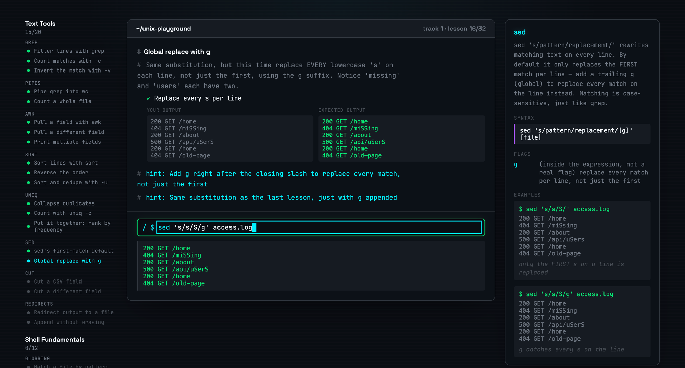

# unix-playground

Interactive, terminal-in-the-browser trainer for Unix text tools and shell
fundamentals. One concept at a time: a right-side reference guide plus
graded exercises of increasing difficulty, typed into a simulated shell —
no real subprocess execution, everything runs against an in-memory virtual
filesystem and a hand-built shell interpreter.



## Stack

React 19 + TypeScript, Vite, `oxlint`. No backend, no router, no state
library — plain React state + `localStorage`.

## Develop

```bash
npm install
npm run dev      # dev server
npm run build    # tsc -b && vite build
npm run lint      # oxlint
```

## Deploy

Pushes to `main` build and deploy to GitHub Pages via
`.github/workflows/deploy.yml`.
